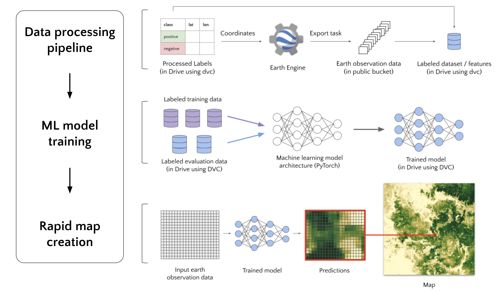

[ta1]: https://github.com/nasaharvest/openmapflow/actions/workflows/crop-mask-example-test.yaml
[tb1]: https://github.com/nasaharvest/openmapflow/actions/workflows/crop-mask-example-test.yaml/badge.svg
[da1]: https://github.com/nasaharvest/openmapflow/actions/workflows/crop-mask-example-deploy.yaml
[db1]: https://github.com/nasaharvest/openmapflow/actions/workflows/crop-mask-example-deploy.yaml/badge.svg

[ta2]: https://github.com/nasaharvest/openmapflow/actions/workflows/buildings-example-test.yaml
[tb2]: https://github.com/nasaharvest/openmapflow/actions/workflows/buildings-example-test.yaml/badge.svg
[da2]: https://github.com/nasaharvest/openmapflow/actions/workflows/buildings-example-deploy.yaml
[db2]: https://github.com/nasaharvest/openmapflow/actions/workflows/buildings-example-deploy.yaml/badge.svg

[ta3]: https://github.com/nasaharvest/openmapflow/actions/workflows/maize-example-test.yaml
[tb3]: https://github.com/nasaharvest/openmapflow/actions/workflows/maize-example-test.yaml/badge.svg
[da3]: https://github.com/nasaharvest/openmapflow/actions/workflows/maize-example-deploy.yaml
[db3]: https://github.com/nasaharvest/openmapflow/actions/workflows/maize-example-deploy.yaml/badge.svg

# OpenMapFlow 🌍
[](https://github.com/nasaharvest/openmapflow/actions/workflows/ci.yaml)
[](https://github.com/nasaharvest/openmapflow/actions/workflows/docker.yaml)
[![tb1]][ta1] [![db1]][da1]
[![tb2]][ta2] [![db2]][da2]
[![tb3]][ta3] [![db3]][da3]


Rapid map creation with machine learning and earth observation data.

[cb]: https://colab.research.google.com/assets/colab-badge.svg

**Examples:** [Cropland](https://github.com/nasaharvest/openmapflow/tree/main/crop-mask-example), [Buildings](https://github.com/nasaharvest/openmapflow/tree/main/buildings-example), [Maize](https://github.com/nasaharvest/openmapflow/tree/main/maize-example)


* [Tutorial](#tutorial-)
* [How it works](#how-it-works)
* [Generating a project](#generating-a-project-)
* [Adding data](#adding-data-)
* [Training a model](#training-a-model-)
* [Creating a map](#creating-a-map-)

## Tutorial [![cb]](https://colab.research.google.com/github/nasaharvest/openmapflow/blob/main/openmapflow/notebooks/tutorial.ipynb)
Colab notebook tutorial demonstrating data exploration, model training, and inference over small region. ([video](https://youtu.be/UHEUB4RSAi4))

**Prerequisites:**
- Github access token (obtained [here](https://docs.github.com/en/authentication/keeping-your-account-and-data-secure/creating-a-personal-access-token))
- [Forked OpenMapFlow repository](https://github.com/nasaharvest/openmapflow/fork)
- Basic Python knowledge 

## How it works 

To create your own maps with OpenMapFlow, you need to 
1. [Generate your own OpenMapFlow project](#generating-a-project-), this will allow you to:
1. [Add your own labeled data](#adding-data-)
2. [Train a model](#training-a-model-) using that labeled data, and 
3. [Create a map](#creating-a-map-) using the trained model.



## Generating a project [![cb]](https://colab.research.google.com/github/nasaharvest/openmapflow/blob/main/openmapflow/notebooks/generate_project.ipynb)

A project can be generated by either following the below documentation OR running the above Colab notebook.

**Prerequisites:**
- [ ] [Github repository](https://docs.github.com/en/get-started/quickstart/create-a-repo) - where your project will be stored
- [ ] [Google/Gmail based account](https://www.google.com/account/about/) - for accessing Google Drive and Google Cloud
- [ ] Google Cloud Project ([create](https://console.cloud.google.com/projectcreate)) - for accessing Cloud resources for creating a map ([additional info](https://cloud.google.com/resource-manager/docs/creating-managing-projects#console))
- [ ] Google Cloud Service Account Key ([generate](
https://cloud.google.com/iam/docs/creating-managing-service-account-keys#iam-service-account-keys-create-console)) - for deploying Cloud resources from Github Actions

Once all prerequisites are satisfied, inside your Github repository run:
```bash
pip install openmapflow
openmapflow generate
```
The command will prompt for project configuration such as project name and Google Cloud Project ID. Several prompts will have defaults shown in square brackets. These will be used if nothing is entered. 

After all configuration is set, the following project structure will be generated:

```
<YOUR PROJECT NAME>
│   README.md
│   datasets.py             # Dataset definitions (how labels should be processed)
│   evaluate.py             # Template script for evaluating a model
│   openmapflow.yaml        # Project configuration file
│   train.py                # Template script for training a model
│   
└─── .dvc/                  # https://dvc.org/doc/user-guide/what-is-dvc
│       
└─── .github
│   │
│   └─── workflows          # Github actions
│       │   deploy.yaml     # Automated Google Cloud deployment of trained models
│       │   test.yaml       # Automated integration tests of labeled data
│       
└─── data
    │   raw_labels/                     # User added labels
    │   datasets/                       # ML ready datasets (labels + earth observation data)
    │   models/                         # Models trained using datasets
    |   raw_labels.dvc                  # Reference to a version of raw_labels/
    |   datasets.dvc                    # Reference to a version of datasets/
    │   models.dvc                      # Reference to a version of models/
    
```

**Github Actions Secrets**
When code is pushed to the repository a Github action will be run to verify project configuration, data integrity, and script functionality. This action will pull data using dvc and thereby needs access to remote storage (your Google Drive). To allow the Github action to access the data, add a new repository secret ([instructions](https://docs.github.com/en/actions/security-guides/encrypted-secrets#creating-encrypted-secrets-for-a-repository)). 
- In step 5 of the instructions, name the secret: `GDRIVE_CREDENTIALS_DATA`
- In step 6, enter the value in .dvc/tmp/gdrive-user-creditnals.json (in your repository)

When a new model is pushed to the repository a Github action will be run to deploy this model to Google Cloud. To allow the Github action to access Google Cloud add a new repository secret ([instructions](https://docs.github.com/en/actions/security-guides/encrypted-secrets#creating-encrypted-secrets-for-a-repository)). 
- In step 5 of the instructions, name the secret: `GCP_SA_KEY`
- In step 6, enter your Google Cloud Service Account Key

After this the Github actions should successfully run.

**GCloud Bucket**:
A Google Cloud bucket must be created for the labeled earth observation files. Assuming gcloud is installed run:
```bash
gcloud auth login
gsutil mb -l <YOUR_OPENMAPFLOW_YAML_GCLOUD_LOCATION> gs://<YOUR_OPENMAPFLOW_YAML_BUCKET_LABELED_EO>
```

## Adding data

#### Adding already existing data
**Prerequisites:**
- [ ] [Generated OpenMapFlow project](#generating-a-project-)

Add reference to already existing dataset in your datasets.py:
```python
from openmapflow.datasets import geowiki_landcover_2017, togo_crop_2019

datasets = [geowiki_landcover_2017, togo_crop_2019]
```
Download and push datasets
```bash
openmapflow create-dataset  # Download datasets
dvc commit && dvc push      # Push data to version control

git add .
git commit -m'Created new dataset'
git push
```

#### Adding custom data [![cb]](https://colab.research.google.com/github/nasaharvest/openmapflow/blob/main/openmapflow/notebooks/new_data.ipynb)

**Prerequisites:**
- [ ] [Generated OpenMapFlow project](#generating-a-project-)
- [ ] [EarthEngine account](https://earthengine.google.com/signup) - for accessing Earth Engine and pulling satellite data
- [ ] Raw labels - a file (csv/shp/zip/txt) containing a list of labels and their coordinates (latitude, longitude)

Move raw labels into project:
```bash
export RAW_LABEL_DIR=$(openmapflow datapath RAW_LABELS)
mkdir RAW_LABEL_DIR/<my dataset name>
cp -r <path to my raw data files> RAW_LABEL_DIR/<my dataset name>
```
Add reference to data using a `CustomLabeledDataset` object in datasets.py, example:
```python
datasets = [
    CustomLabeledDataset(
        dataset="example_dataset",
        country="Togo",
        raw_labels=(
            RawLabels(
                filename="Togo_2019.csv",
                longitude_col="longitude",
                latitude_col="latitude",
                class_prob=lambda df: df["crop"],
                start_year=2019,
            ),
        ),
    ),
    ...
]
```
Run dataset creation:
```bash
earthengine authenticate    # For getting new earth observation data
gcloud auth login           # For getting cached earth observation data

openmapflow create-dataset  # Initiatiates or checks progress of dataset creation

dvc commit && dvc push      # Push new data to data version control

git add .
git commit -m'Created new dataset'
git push
```


## Training a model [![cb]](https://colab.research.google.com/github/nasaharvest/openmapflow/blob/main/openmapflow/notebooks/train.ipynb)

**Prerequisites:**
- [ ] [Generated OpenMapFlow project](#generating-a-project-)
- [ ] [Added labeled data](#adding-data-)

```bash
# Pull in latest data
dvc pull    
tar -xzf $(openmapflow datapath COMPRESSED_FEATURES) -C data

# Set model name, train model, record test metrics
export MODEL_NAME=<YOUR MODEL NAME>              
python train.py --model_name $MODEL_NAME    
python evaluate.py --model_name $MODEL_NAME 

# Push new models to data version control
dvc commit 
dvc push  

# Make a Pull Request to the repository
git checkout -b"$MODEL_NAME"
git add .
git commit -m "$MODEL_NAME"
git push --set-upstream origin "$MODEL_NAME"
```

Now after merging the pull request, the model will be deployed to Google Cloud.

## Creating a map [![cb]](https://colab.research.google.com/github/nasaharvest/openmapflow/blob/main/openmapflow/notebooks/create_map.ipynb)
**Prerequisites:**
- [ ] [Generated OpenMapFlow project](#generating-a-project-)
- [ ] [Added labeled data](#adding-data-)
- [ ] [Trained model](#training-a-model-)

Only available through Colab. Cloud Architecture must be deployed using the deploy.yaml Github Action.


